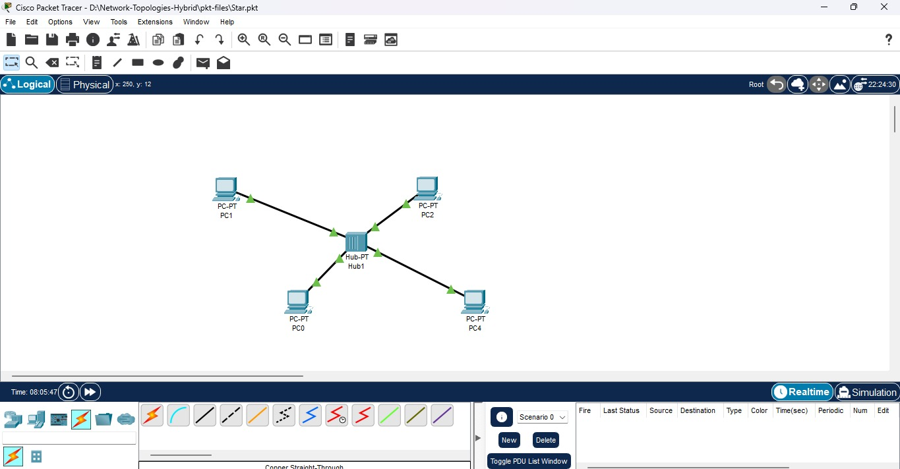
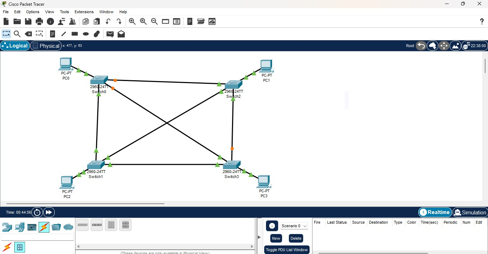
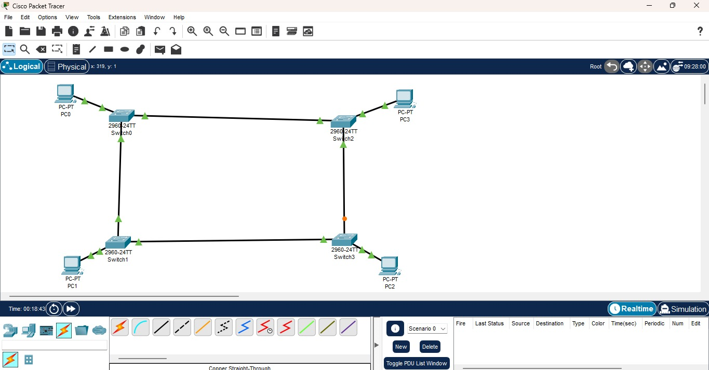
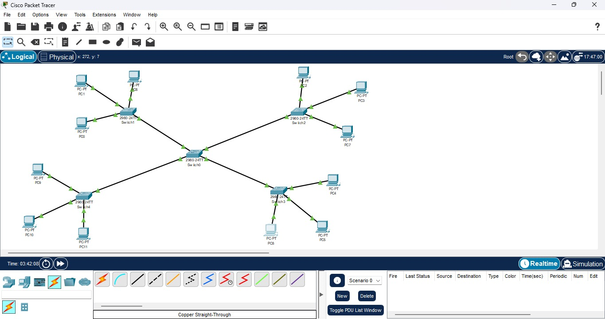
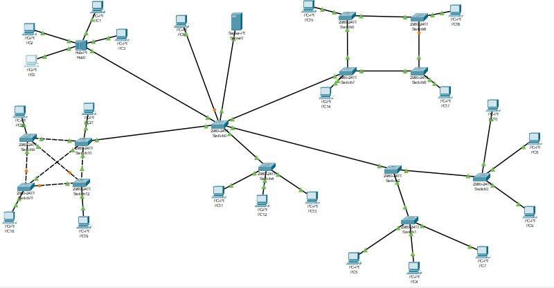

# CMPG 325 Computer Networks Individual Project (2025)

## Faculty of Natural & Agricultural Science
**Department of Computer Science**

---

## 📌 Project Overview
This repository contains the implementation and the documentation of CMPG 325 Computer Networks semester-long project.  
The project demonstrates the design, configuration, and simulation of the network topologies using Cisco Packet Tracer, with emphasis on IPv4 & IPv6 addressing, VLAN segmentation, server configuration, and network security.

---

## 🎯 Project Objectives
1. **Part I – Network Topologies Design & Simulation (60%)**  
   - Implement 5 topologies: Bus, Mesh, Star, Ring, and Extended Star topologies.  
   - Design a Hybrid topology integrating elements of the above 5 topologies.  
   - Configure IPv4/IPv6 addressing, VLAN segmentation, servers (HTTP/DNS/DHCP), and basic security.  
   - Document the process with IP tables, screenshots, and configuration notes.  

2. **Part II – Network Feature Configuration (20%)**  
   - Configure Port-based VLANs with trunking (802.1Q).  

3. **Part III – Video Demonstration (20%)**  
   - Record a 15–30 minute demonstration video explaining the designs, configurations, and testing results.  

___________________________________________________________________________________________________________________________

## 🖥 Part I – Network Topologies

### 1. Bus Topology
The Bus topology connects multiple devices using a single central hub, simulating a shared communication medium. All PCs are connected to the hub, and data travels across the same backbone. Bus Topology was the first because it seemed different due to the Hub instead of Switch, but according to the plan, Star was the first, that is why Bus is using subnet __20__ and Star is using __10__

#### IPv4 Addressing Table
| Device | Interface | IPv4 Address  | Subnet Mask     | Default Gateway |
|--------|-----------|---------------|-----------------|----------------|
| PC0    | FastEthernet0 | 192.168.20.2 | 255.255.255.0 | 192.168.20.1 |
| PC1    | FastEthernet0 | 192.168.20.3 | 255.255.255.0 | 192.168.20.1 |
| PC2    | FastEthernet0 | 192.168.20.4 | 255.255.255.0 | 192.168.20.1 |
| PC3    | FastEthernet0 | 192.168.20.5 | 255.255.255.0 | 192.168.20.1 |

#### Screenshot


#### Configuration Notes
- Used a hub to represent the shared bus.  
- All PCs configured in the same subnet.  
- Successful ping tests confirmed communication between devices.  

[Download the Cisco Packet Tracer topology - Bus](pkt-files/Bus.pkt)

---

### 2. Star Topology
The Star topology connects all devices to a central switch. Each PC has its own dedicated link to the switch, making it reliable and easy to manage.

#### IPv4 Addressing Table
| Device | Interface | IPv4 Address  | Subnet Mask     | Default Gateway |
|--------|-----------|---------------|-----------------|----------------|
| PC0    | FastEthernet0 | 192.168.10.2 | 255.255.255.0 | 192.168.10.1 |
| PC1    | FastEthernet0 | 192.168.10.3 | 255.255.255.0 | 192.168.10.1 |
| PC2    | FastEthernet0 | 192.168.10.4 | 255.255.255.0 | 192.168.10.1 |
| PC3    | FastEthernet0 | 192.168.10.5 | 255.255.255.0 | 192.168.10.1 |


#### Screenshot

#### ptk file
[Download the Cisco Packet Tracer topology - Star](pkt-files/Star.pkt)

#### Configuration Notes
- PCs connected to a central switch.  
- Each PC assigned IPv4 addresses in the same subnet.  
- The ping tests were successful between PCs to confirm connectivity.

---

### 3. Mesh Topology
The Mesh topology connects every switch to every other switch, and each PC is connected to its dedicated switch. This setup ensures high redundancy and reliability. Even if one link fails, all PCs can still communicate through alternative paths.

#### IPv4 Addressing Table
| Device | Interface | IPv4 Address  | Subnet Mask     | Default Gateway |
|--------|-----------|---------------|-----------------|----------------|
| PC0    | FastEthernet0 | 192.168.30.2 | 255.255.255.0 | 192.168.30.1 |
| PC1    | FastEthernet0 | 192.168.30.3 | 255.255.255.0 | 192.168.30.1 |
| PC2    | FastEthernet0 | 192.168.30.4 | 255.255.255.0 | 192.168.30.1 |
| PC3    | FastEthernet0 | 192.168.30.5 | 255.255.255.0 | 192.168.30.1 |

#### Screenshot


#### Configuration Notes
- Each PC connected to a dedicated switch.  
- All switches connected to every other switch to simulate full mesh connectivity.  
- Assigned IPv4 addresses within the same subnet.  
- Connectivity was verified through ping tests between all PCs.  

[Download the Cisco Packet Tracer topology - Mesh](pkt-files/mesh.pkt)

---
### 4. Ring Topology
The Ring topology connects devices in a closed loop, where each device is connected to exactly two others, forming a circular pathway. Data travels in one or both directions around the ring.

#### IPv4 Addressing Table
| Device | Interface | IPv4 Address  | Subnet Mask     | Default Gateway |
|--------|-----------|---------------|-----------------|----------------|
| PC0    | FastEthernet0 | 192.168.40.2 | 255.255.255.0 | 192.168.40.1 |
| PC1    | FastEthernet0 | 192.168.40.3 | 255.255.255.0 | 192.168.40.1 |
| PC2    | FastEthernet0 | 192.168.40.4 | 255.255.255.0 | 192.168.40.1 |
| PC3    | FastEthernet0 | 192.168.40.5 | 255.255.255.0 | 192.168.40.1 |

#### Screenshot


#### Configuration Notes
- Each PC connected to a switch forming a circular ring.  
- Each switch connected to two other switches to complete the loop.  
- IPv4 addresses assigned in the same subnet.  
- Connectivity confirmed with successful ping tests around the ring.  

[Download the Cisco Packet Tracer topology - Ring](pkt-files/ring.pkt)

---

### 5. Extended Star Topology
The Extended Star topology is a hierarchical structure where a central switch connects to multiple peripheral switches, and each peripheral switch connects to several PCs. This design provides scalability and improved management compared to a simple star.

#### IPv4 Addressing Table
All devices are assigned IP addresses from the same subnet (192.168.50.0/24). This allows direct communication between all PCs without requiring a router.

| Device | Interface      | IPv4 Address   | Subnet Mask     | Default Gateway |
|--------|----------------|----------------|-----------------|----------------|
| PC0    | FastEthernet0  | 192.168.50.2   | 255.255.255.0   | 192.168.50.1   |
| PC1    | FastEthernet0  | 192.168.50.3   | 255.255.255.0   | 192.168.50.1   |
| PC2    | FastEthernet0  | 192.168.50.4   | 255.255.255.0   | 192.168.50.1   |
| PC3    | FastEthernet0  | 192.168.50.5   | 255.255.255.0   | 192.168.50.1   |
| PC4    | FastEthernet0  | 192.168.50.6   | 255.255.255.0   | 192.168.50.1   |
| PC5    | FastEthernet0  | 192.168.50.7   | 255.255.255.0   | 192.168.50.1   |
| PC6    | FastEthernet0  | 192.168.50.8   | 255.255.255.0   | 192.168.50.1   |
| PC7    | FastEthernet0  | 192.168.50.9   | 255.255.255.0   | 192.168.50.1   |
| PC8    | FastEthernet0  | 192.168.50.10  | 255.255.255.0   | 192.168.50.1   |
| PC9    | FastEthernet0  | 192.168.50.11  | 255.255.255.0   | 192.168.50.1   |
| PC10   | FastEthernet0  | 192.168.50.12  | 255.255.255.0   | 192.168.50.1   |
| PC11   | FastEthernet0  | 192.168.50.13  | 255.255.255.0   | 192.168.50.1   |

#### Screenshot
 

#### Configuration Notes
- 1 central switch connects to 4 peripheral switches.  
- Each peripheral switch connects to 3 PCs (total 12 PCs).  
- All PCs share the subnet 192.168.50.0/24 for simplicity.  
- Verified full connectivity with successful ping tests between PCs across all switches.  

[Download the Cisco Packet Tracer topology - Extended Star](pkt-files/exStar.pkt)

---

## Part I – Hybrid Network Topology

### 1. Overview
This section documents the **Hybrid network** integrating all 5 topologies: Star, Bus, Ring, Mesh, and Extended Star.  
The network consists of 22 PCs, one Core Switch (Cisco 2960), one Hub (PT Hub0 for Bus segment), and a server providing DNS, HTTP, and DHCP services.

---

### 2. IP Address Plan
All devices are in a **single subnet** (`192.168.100.0/24`) for simplicity and connectivity.

| Device Type | Devices          | IP Addresses               | Notes |
|-------------|-----------------|----------------------------|-------|
| PCs         | PC0 – PC21      | 192.168.100.2 – 192.168.100.23 | Sequential assignment per branch |
| Server      | Server0         | 192.168.100.20             | DNS, HTTP, DHCP |
| Core Switch | Switch0 (2960)  | N/A                        | Connects all branches |
| Hub         | PT Hub0         | N/A                        | Bus segment only |

---

### 3. Topology Segments

#### Bus Branch
- 4 PCs connected to **PT Hub0**; hub uplinked to Core Switch.
- IPs: 192.168.10.2 – 192.168.10.5
- Screenshot: `bus_branch.jpeg`
- Notes: Hub simulates shared bus medium. PCs tested with ping within branch and to other branches.

#### Star Branch
- 3 PCs connected to one switch.
- IPs: 192.168.10.6 – 192.168.10.8
- Screenshot: `star_branch.jpeg` 
- Notes: Central switch allows full connectivity to Hybrid.

#### Extended Star Branch
- 6 PCs connected across 2 switches forming extended star.
- One switch uplinked to Core Switch.
- IPs: 192.168.10.9 – 192.168.10.14
- Screenshot: `extended_star_branch.jpeg`
- Notes: Mirrors Star topology with more devices.

#### Ring Branch
- 3 switches connected in a loop, each with one PC.
- One switch uplinked to Core Switch.
- IPs: 192.168.10.15 – 192.168.10.18
- Screenshot: `ring_branch.jpeg`
- Notes: Redundancy tested; ping succeeds across all PCs.

#### Mesh Branch
- 3 switches fully interconnected; each switch has one PC.
- One switch uplinked to Core Switch.
- IPs: 192.168.10.19 – 192.168.10.22
- Screenshot: `mesh_branch.jpeg`
- Notes: Fully connected internal paths, tested with ping.

---

### 4. Server Configuration
- **Server IP:** 192.168.10.100
- **Admin PC IP:** 192.168.10.101
- **Services:** DNS, HTTP, DHCP  
- **DNS Domains:** Example test domain `www.local.com` resolving to server IP.  

---

### 5. Hybrid Overview
- All branches are connected via the **Core Switch (2960)**.  
- **Single subnet** ensures all PCs can ping each other and reach the server.
- **The server** is directly connected to the Core Switch, ensuring centralized access for all branches. Its services (DNS, HTTP, DHCP) are reachable across the entire hybrid topology.
- Hybrid screenshot: `Hybrid.jpeg`  
 
- Notes:  
  - Orange link lights observed but connectivity verified  
  - All branches tested individually and collectively  
  - Ping tests confirm successful data exchange across all PCs

  [Download the Cisco Packet Tracer topology - Hybrid Full](pkt-files/hybrid.pkt)

---

### 6. Extra Notes
- Total PCs: 22 (PC0 – PC21)
- Server & Admin PC port connections
- Ping tests verified
- Envelope simulation pending services
- Hub used only in Bus segment.  
- VLANs not configured in Part I.    

---


---
## Part II – VLAN Configuration & Trunking (802.1Q)

### 1. Overview
Part II focuses on segmenting the network into **VLANs for each branch** and configuring **trunking** on uplink ports.  
VLANs improve *security*, *broadcast control*, and *network organization & management.*

- **Core Switch:** Cisco 2960 (Switch0)  
- **Branches:** Star, Bus, Ring, Mesh, Extended Star
- **Special Network:** Hybrid (with server and admin PC)
  
- **VLANs:**
   + Branch VLANs (10 - 50)
   + Server VLAN(100)
   + Management VLAN(99)
    
- **Security Note:**
VLAN99 is reserved for switch management and accessible only by authorized PC. Basic security is achieved by VLAN segmentation.

---

### 2. VLAN Overview & IP Addressing

| VLAN | Name      | Devices / Notes                   | IP/Subnet          |
|------|-----------|----------------------------------|------------------|
| 10   | STAR      | Star branch PCs (3)               | 192.168.10.0/24  |
| 20   | BUS       | Bus branch PCs (4 via hub)       | 192.168.20.0/24  |
| 30   | RING      | Ring branch PCs (4 across 3 switches) | 192.168.30.0/24 |
| 40   | MESH      | Mesh branch PCs (4 across 3 switches) | 192.168.40.0/24 |
| 50   | EXT_STAR  | Extended Star branch PCs (4 across 2 switches) | 192.168.50.0/24 |
| 99   | MGMT      | Switch0 management (authorized PC only) | 192.168.99.2   |
| 100  | SERVER    | Server providing DNS, HTTP, DHCP | 192.168.100.20  |

- ✅ **Server IP:** 192.168.100.20
- ✅ **Admin IP:** 192.168.99.10
- ✅ **DNS for all PCs:** 192.168.100.20 (Server IP)

---

### 3. Physical Connectivity
- PCs Connected to branch switches (depending on topology type).
- Branch Switches connected to the Core Switch (Switch0) via **trunk links.**
- The *Server* connects directly to Switch) via VLAN100.
- The **Admin PC** connect directly to the **Switch0** on VLAN99(as management).
- Hybrid PCs(9-14) use VLAN100 for server-based applications and cross branch services.

**Topology Path:**
- PCs → Branch Switches → Switch0 (Core)  
- Bus branch PCs connected via hub → Switch0  
- Server directly connected to Switch0 → VLAN100  
- Admin PC directly connected to Switch0
  

---

### 4. Switch0 VLAN Configuration (CLI commands)
```bash
enable
configure terminal
vlan 10
 name STAR
vlan 20
 name BUS
vlan 30
 name RING
vlan 40
 name MESH
vlan 50
 name EXT_STAR
vlan 99
 name MGMT
vlan 100
 name SERVER
exit

interface vlan 99
 ip address 192.168.99.2 255.255.255.0
 no shutdown
exit
```
- **Access ports** are assigned to the VLAN corresponding to the connected PC or server  
- **Server port** is assigned to VLAN100
- **Admin PC port** assigned to VLAN99

---

### 5. Trunk Port Planning

| Port  | Connected Branch | Allowed VLANs      |
|--------|------------------|--------------------|
| Fa0/1  | Star Branch      | 10, 99, 100        |
| Fa0/2  | Bus Branch       | 20, 99, 100        |
| Fa0/3  | Ring Branch      | 30, 99, 100        |
| Fa0/4  | Mesh Branch      | 40, 99, 100        |
| Fa0/5  | Extended Star    | 50, 99, 100        |

- **Allowed VLANs on trunks:** 10, 20, 30, 40, 50, 99, 100  for full Hybrid communication 

---

### 6. Trunk Configuration (CLI Command)
```bash
Switch0> enable
Switch0# configure terminal
Switch0(config)# interface range FastEthernet0/1 - 5
Switch0(config-if-range)# switchport mode trunk
Switch0(config-if-range)# switchport trunk allowed vlan 10,20,30,40,50,99,100
Switch0(config-if-range)# exit
Switch0(config)# exit
```
> each **Branch switch uplink** must mirrors the trunk configuration  

---

### 7. Verification
- `show interfaces trunk` → Check trunk status and allowed VLANs  
- `show vlan brief` → Check VLAN assignments and ports  
- `ping <PC IP>` → Test connectivity within VLAN  

- ✅All VLANs created and active on Switch0.  
- ✅Trunk links established successfully
- ✅PCs within the same VLAN can ping each other
- ✅Server (192.168.100.20) reachable from all PCs
- ✅ Admin PC (192.168.99.10) can manage Switch0 (192.168.99.2). 
- ✅ Hybrid PCs (VLAN100) can communicate with the server and across VLANs through inter-VLAN routing
- ⚙️ Mail service currently works only to/from the server (client-to-client mail still under testing).


---

### 8. Notes
- VLAN99 is for secure switch management only  
- VLAN100 serves both Server and Hybrid PC subnet.  
- Each branch VLAN isolates traffic from other branches
- All devices use the server’s DNS (192.168.100.20)
- Basic security implemented via VLAN separation and controlled management access.

---

### 9. Status

| Task | Description | Status |
|------|--------------|--------|
| VLANs created | VLANs 10–100 configured | ✅ |
| Trunks configured | Fa0/1–Fa0/5 trunking active | ✅ |
| Management VLAN setup | VLAN99 and Admin PC tested | ✅ |
| Server VLAN operational | VLAN100 working | ✅ |
| Connectivity test | Ping successful between all PCs | ✅ |
| Email test | Working from clients → Server only | ⚙️ (Partial) |

✅ **Part II Completed:** VLAN segmentation, trunking setup, management VLAN, server VLAN, and basic security implemented.

---

## 🎥 Part III – Video Demonstration
*(To be completed after documentation and configuration are done)*

---

## ✅ Conclusion
This project demonstrates the design and configuration of multiple network topologies in Cisco Packet Tracer, the implementation of VLANs, and the documentation of results in line with the CMPG 325 rubric.

---

